# CMTAT Factory — Full Documentation

> This is the complete specification of the CMTAT Factory project.
> For a short overview and quick start, see the [root README](../README.md).

## Introduction

This project provides a modular deployment framework for [**CMTAT**](https://github.com/CMTA/CMTAT), a security token framework, using three upgradeability patterns: **UUPS proxy**, **Transparent proxy**, and **Beacon proxy**.
Each factory contract automates deployment using **deterministic addresses (via CREATE2)** and initializes CMTAT instances with a structured set of parameters passed in arguments by the deployer.

In addition to the three standard factories, two **CMTAT Light** factories (`CMTAT_LIGHT_TP_FACTORY` and `CMTAT_LIGHT_BEACON_FACTORY`) deploy the lighter `CMTATUpgradeableLight` implementation. They behave exactly like their standard Transparent/Beacon counterparts but take the smaller `CMTAT_LIGHT_ARGUMENT` initializer struct (admin + ERC20 attributes only).

> **Note:** This project has not undergone an audit and is provided as-is without any warranties.

### Overview

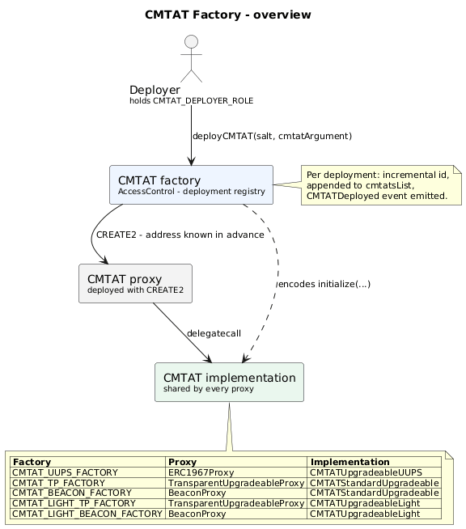

_Diagram source: [`doc/schema/plantuml/overview.puml`](./schema/plantuml/overview.puml)._

## Table of Contents

- [Introduction](#introduction)
  - [Overview](#overview)
  - [Key features](#key-features)
  - [Factory Overview](#factory-overview)
  - [CMTAT versions: Standard vs Light](#cmtat-versions-standard-vs-light)
- [Library contracts](#library-contracts)
  - [CMTATFactoryBase](#cmtatfactorybase)
  - [CMTATFactoryRoot](#cmtatfactoryroot)
- [Deterministic deployment: `CREATE` vs `CREATE2`](#deterministic-deployment-create-vs-create2)
- [Common factory API](#common-factory-api)
  - [Versioning (ERC-8303)](#versioning-erc-8303)
  - [Events](#events)
  - [Deployment tracking](#deployment-tracking)
  - [Salt behavior](#salt-behavior)
  - [Access control](#access-control)
- [Factory contracts](#factory-contracts)
  - [Proxy patterns: Transparent vs UUPS vs Beacon](#proxy-patterns-transparent-vs-uups-vs-beacon)
  - [Note](#note)
  - [Note (CMTAT Light)](#note-cmtat-light)
  - [Beacon Proxy Factory](#beacon-proxy-factory)
  - [Transparent Proxy Factory](#transparent-proxy-factory)
  - [UUPS ProxyFactory](#uups-proxyfactory)
  - [CMTAT Light Factories](#cmtat-light-factories)
- [Usage instructions](#usage-instructions)
  - [Dependencies](#dependencies)
  - [Installation](#installation)
  - [Hardhat](#hardhat)
  - [Generate documentation](#generate-documentation)
- [Security](#security)
  - [Vulnerability disclosure](#vulnerability-disclosure)
  - [Audit](#audit)
  - [Tools](#tools)
- [Further reading](#further-reading)
- [Intellectual property](#intellectual-property)

### Key features

- **Multiple proxy types** — choose UUPS, Transparent, or Beacon depending on your upgrade strategy.
- **Role-based security** — only authorized deployers can create new instances.
- **Predictable deployments** — computed addresses allow you to know the resulting contract address before deploying.
- **Self-contained factories** — each factory handles its own proxy administration logic.

### Factory Overview

- **UUPS Proxy Factory**
  - Deploys CMTAT behind a UUPS proxy ([ERC-1822](https://eips.ethereum.org/EIPS/eip-1822)) with minimal admin overhead.
  - Contract: [CMTAT_UUPS_FACTORY.sol](../contracts/standard/CMTAT_UUPS_FACTORY.sol) 
- **Transparent Proxy Factory**
  - Deploys CMTAT behind a TransparentUpgradeableProxy with a dedicated ProxyAdmin contract.
  - Contract: [CMTAT_TP_FACTORY.sol](../contracts/standard/CMTAT_TP_FACTORY.sol)
- **Beacon Proxy Factory**
  - Deploys CMTAT behind a BeaconProxy using an UpgradeableBeacon for shared implementation upgrades.
  - Contract: [CMTAT_BEACON_FACTORY.sol](../contracts/standard/CMTAT_BEACON_FACTORY.sol)
- **CMTAT Light Transparent Proxy Factory**
  - Deploys the lighter `CMTATUpgradeableLight` implementation behind a TransparentUpgradeableProxy.
  - Contract: [CMTAT_LIGHT_TP_FACTORY.sol](../contracts/light/CMTAT_LIGHT_TP_FACTORY.sol)
- **CMTAT Light Beacon Proxy Factory**
  - Deploys the lighter `CMTATUpgradeableLight` implementation behind a BeaconProxy.
  - Contract: [CMTAT_LIGHT_BEACON_FACTORY.sol](../contracts/light/CMTAT_LIGHT_BEACON_FACTORY.sol)

### CMTAT versions: Standard vs Light

This project deploys two variants of the [CMTAT](https://github.com/CMTA/CMTAT) implementation (pinned at **v3.3.0-rc3**), each initialized with its own argument struct.

- **CMTAT Standard** — the full-featured security token.
  - Used by the UUPS, Transparent, and Beacon factories: `CMTATUpgradeableUUPS` (UUPS) and `CMTATStandardUpgradeable` (Transparent / Beacon).
  - Includes the complete CMTAT module set: ERC-20 with mint/burn, pause, enforcement (freeze / forced transfer), validation backed by an external **RuleEngine**, document management (ERC-1643), snapshots, debt, cross-chain (ERC-20 bridging), gasless meta-transactions (ERC-2771), and ERC-7551 enforcement.
  - Initialized with the full [`CMTAT_ARGUMENT`](#factory-contracts) struct (admin, ERC-20 attributes, extra information, and the `Engine` rule-engine address).

- **CMTAT Light** — a minimal, cheaper-to-deploy variant.
  - Used by the two Light factories: `CMTATUpgradeableLight`.
  - Keeps only the core security-token features: ERC-20 with mint/burn, pause, enforcement, allowlist/allowance validation, and access control. It drops the heavier extensions (RuleEngine, documents, snapshots, debt, cross-chain, meta-transactions, ERC-7551).
  - Initialized with the smaller [`CMTAT_LIGHT_ARGUMENT`](#note-cmtat-light) struct (admin and ERC-20 attributes only).

Choose **Light** when you only need a self-contained transfer-restricted token, and **Standard** when you need rule engines, documents, snapshots, or cross-chain support.

## Library contracts

The factories are built from a small set of abstract base contracts in `contracts/libraries/`:

| Contract | Inherits | Used by | Responsibility |
| --- | --- | --- | --- |
| `CMTATFactoryInvariant` | — | all factories | Declares the shared structs (`CMTAT_ARGUMENT`, `CMTAT_LIGHT_ARGUMENT`), the `CMTAT_DEPLOYER_ROLE` constant, and the `CMTAT` / `CMTATDeployed` events. |
| `ContractVersion` | `ERC165`, `IERC8303` | `CMTATFactoryRoot` | ERC-8303 `version()` (`"0.5.0"`) and ERC-165 `supportsInterface`. |
| `CMTATFactoryRoot` | `AccessControl`, `ContractVersion`, `CMTATFactoryInvariant` | all factories | Deployment index (`cmtatsList`, `cmtatCounterId`, `CMTATProxyAddress`), salt logic (`useCustomSalt`, `nextDeploymentSalt`, `_checkAndDetermineDeploymentSalt`, `_computeDeploymentSalt`), and CREATE2 deploy + registration (`_deployAndRegisterProxy`). |
| `CMTATFactoryBase` | `CMTATFactoryRoot` | UUPS & Transparent factories | Stores the immutable `logic` implementation and reverts on a zero logic address. |
| `CMTATTransparentFactoryBase` | `CMTATFactoryBase` | `CMTAT_TP_FACTORY`, `CMTAT_LIGHT_TP_FACTORY` | Transparent proxy bytecode, address prediction, `proxyAdminOwner` validation, and deployment. |
| `CMTATBeaconFactoryBase` | `CMTATFactoryRoot` | `CMTAT_BEACON_FACTORY`, `CMTAT_LIGHT_BEACON_FACTORY` | Creates the `UpgradeableBeacon` (validating `beaconOwner`), exposes `implementation()`, and handles beacon proxy bytecode, prediction, and deployment. |
| `FactoryErrors` | — (library) | all factories | Custom errors (zero-address guards and `CMTAT_Factory_SaltAlreadyUsed`). |

### CMTATFactoryBase


|       Contract       |       Type        |      Bases       |                |                  |
| :------------------: | :---------------: | :--------------: | :------------: | :--------------: |
|          └           | **Function Name** |  **Visibility**  | **Mutability** |  **Modifiers**   |
|                      |                   |                  |                |                  |
| **CMTATFactoryBase** |  Implementation   | CMTATFactoryRoot |                |                  |
|          └           |   <Constructor>   |     Public ❗️     |       🛑        | CMTATFactoryRoot |


### CMTATFactoryRoot

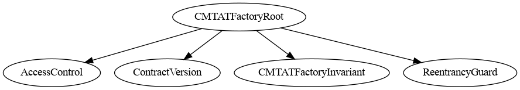


|       Contract       |               Type               |                       Bases                        |                |               |
| :------------------: | :------------------------------: | :------------------------------------------------: | :------------: | :-----------: |
|          └           |        **Function Name**         |                  **Visibility**                    | **Mutability** | **Modifiers** |
|                      |                                  |                                                    |                |               |
| **CMTATFactoryRoot** |          Implementation          | AccessControl, ContractVersion, CMTATFactoryInvariant |             |               |
|          └           |          <Constructor>           |               Public ❗️               |       🛑        |      NO❗️      |
|          └           |        CMTATProxyAddress         |               Public ❗️               |                |      NO❗️      |
|          └           |        supportsInterface         |               Public ❗️               |                |      NO❗️      |
|          └           |        nextDeploymentSalt        |               Public ❗️               |                |      NO❗️      |
|          └           | _checkAndDetermineDeploymentSalt |              Internal 🔒              |       🛑        |               |
|          └           |       _computeDeploymentSalt     |              Internal 🔒              |                |               |
|          └           |      _deployAndRegisterProxy     |              Internal 🔒              |       🛑        |               |


## Deterministic deployment: `CREATE` vs `CREATE2`

Every factory deploys its proxies with the **`CREATE2`** opcode instead of the default `CREATE`. The difference is how the new contract's address is derived.

- **`CREATE`** (the default when you do `new Contract()`):

  ```text
  address = keccak256(rlp_encode(deployerAddress, deployerNonce))[12:]
  ```

  The address depends on the **deployer's account nonce**, which increases with every transaction/contract the deployer makes. You therefore cannot reliably know the address in advance — it depends on how many deployments happened before, and in what order.

- **`CREATE2`** ([EIP-1014](https://eips.ethereum.org/EIPS/eip-1014)):

  ```text
  address = keccak256(0xff ++ deployerAddress ++ salt ++ keccak256(init_code))[12:]
  ```

  The address depends only on the **deployer address** — here the **factory contract address**, since the proxy is deployed through `Create2.deploy` executed inside the factory — a caller-chosen **`salt`**, and the **`init_code`** (creation bytecode + ABI-encoded constructor arguments) — **not** on the nonce. Given those three inputs the address is fully deterministic and can be computed *before* deploying (a "counterfactual" address).

**Why this project uses `CREATE2`**

- It lets you compute a token's address ahead of time via `computedProxyAddress(...)` / `computedNextProxyAddress(...)` and, for example, fund it or reference it before it exists on-chain.
- Because `init_code` is part of the hash, the predicted address is bound to the exact proxy bytecode **and** the CMTAT initializer arguments. Changing any constructor arg, proxy type, or initializer payload changes the resulting address — which is why the deploy path and the address-prediction path must stay byte-for-byte in sync.
- A given `(deployer, salt, init_code)` triple maps to exactly one address, so a salt can only be used once. The factory enforces this for custom salts (`CMTAT_Factory_SaltAlreadyUsed`) and, in non-custom mode, derives a fresh salt from `cmtatCounterId` for each deployment. See [Salt behavior](#salt-behavior).

## Common factory API

All factories inherit `CMTATFactoryRoot` and share the following surface, in addition to the proxy-specific `deployCMTAT` / `computedProxyAddress` documented per factory below.

### Versioning (ERC-8303)

Factories implement [ERC-8303](https://github.com/ethereum/ERCs/pull/1819) (still a draft pull request, not yet published on the Ethereum website) through `ContractVersion` and expose the factory version:

```solidity
function version() external view returns (string memory); // current: "0.5.0"
```

`supportsInterface(bytes4)` (ERC-165) returns `true` for `type(IERC8303).interfaceId`, in addition to the `AccessControl` interfaces.

### Events

Every successful deployment emits one event:

```solidity
event CMTATDeployed(address indexed proxy, address indexed deployer, uint256 indexed id, bytes32 salt);
```

It records the deployed `proxy`, the `deployer` (`msg.sender`), the incremental `id`, and the effective `salt` used by CREATE2.

### Deployment tracking

| Member | Type | Description |
| --- | --- | --- |
| `cmtatCounterId` | `uint256` | Number of CMTAT instances deployed; also the `id` assigned to the next deployment. Incremented by exactly one per deployment. |
| `CMTATProxyAddress(uint256 id)` | `address` | Address of the deployed proxy for a given `id`. |
| `cmtatsList(uint256)` | `address` | Array of every deployed proxy address, in deployment order. |

### Salt behavior

| Member | Type | Description |
| --- | --- | --- |
| `useCustomSalt` | `bool` (immutable) | If `false`, the factory derives the salt itself; if `true`, the caller-supplied salt is used. |
| `nextDeploymentSalt()` | `bytes32` | The salt the next non-custom deployment will use: `keccak256(abi.encodePacked(cmtatCounterId))`. |
| `computedNextProxyAddress(...)` | `address` | Predicts the next proxy address using the same salt selection as `deployCMTAT` (custom salt when `useCustomSalt == true`, otherwise `nextDeploymentSalt()`). Same trailing arguments as the factory's `deployCMTAT`. |

- When `useCustomSalt == false`, the salt is always `keccak256(abi.encodePacked(cmtatCounterId))`; the `deploymentSaltInput` argument is ignored.
- When `useCustomSalt == true`, the caller-supplied salt is used directly and is **one-time-use**: reusing a salt reverts with `FactoryErrors.CMTAT_Factory_SaltAlreadyUsed()`.
- `computedProxyAddress(...)` takes an *effective* salt and mirrors the exact bytecode used by `deployCMTAT(...)`, while `computedNextProxyAddress(...)` applies the same salt-selection logic as a real deployment.

> **⚠️ Warning — counter mode has no per-caller address reservation.**
> When `useCustomSalt == false`, the salt is the shared `keccak256(abi.encodePacked(cmtatCounterId))`, so
> `nextDeploymentSalt()` and `computedNextProxyAddress(...)` only predict the address of the *factory's* next
> deployment — by whichever authorized deployer transacts first. If another `CMTAT_DEPLOYER_ROLE` holder deploys
> before you, the counter advances and your token lands at a **different** address; anything you pre-funded or
> pre-authorized at the predicted address is stranded.
>
> **The safer mode is to enable custom salts (`useCustomSalt == true`) and pass a unique, caller-chosen `salt`.**
> A custom salt is one-time-use (reuse reverts with `CMTAT_Factory_SaltAlreadyUsed`), binds the predicted address
> to *your* deployment, and cannot be shifted by another deployer — so `computedProxyAddress(...)` /
> `computedNextProxyAddress(...)` give you a stable, reservable address you can safely pre-fund. Use counter mode
> only for single-deployer or coordinated deployments.

### Access control

All factories inherit OpenZeppelin `AccessControl`. The constructor grants both `DEFAULT_ADMIN_ROLE` and `CMTAT_DEPLOYER_ROLE` to `factoryAdmin`, and `deployCMTAT(...)` is gated by `onlyRole(CMTAT_DEPLOYER_ROLE)`.

### Reentrancy protection

Each concrete factory inherits OpenZeppelin `ReentrancyGuard` and marks its `deployCMTAT(...)` entrypoint `nonReentrant` (declared first, before `onlyRole`).

In counter mode the effective salt is derived from `cmtatCounterId`, which is only incremented **after** `Create2.deploy`. Since `Create2.deploy` runs the proxy constructor — and its CMTAT initializer — before that increment, a reentrant `deployCMTAT(...)` call could otherwise observe the same `cmtatCounterId` and reuse the same auto-derived salt (Nethermind AuditAgent NM-2). The guard rejects any attempt to re-enter the deploy path mid-deployment, so every automatic deployment sees a distinct counter value and salt, keeping the deployment index and emitted events consistent.

## Factory contracts

### Proxy patterns: Transparent vs UUPS vs Beacon

All three patterns let a proxy delegate calls to an upgradeable implementation, but they differ in **where the upgrade logic lives**, **who controls upgrades**, and **whether proxies upgrade individually or together**. The table below summarises the differences as implemented in this repo.

| | **UUPS** (`CMTAT_UUPS_FACTORY`) | **Transparent** (`CMTAT_TP_FACTORY`) | **Beacon** (`CMTAT_BEACON_FACTORY`) |
| --- | --- | --- | --- |
| Proxy contract | `ERC1967Proxy` | `TransparentUpgradeableProxy` | `BeaconProxy` (+ one shared `UpgradeableBeacon`) |
| Where upgrade logic lives | In the **implementation** (`CMTATUpgradeableUUPS` inherits `UUPSUpgradeable`) | In the **proxy** | In the **beacon** |
| Upgrade authority | `PROXY_UPGRADE_ROLE` on the token itself (`_authorizeUpgrade`) | A dedicated **`ProxyAdmin`** contract, one per proxy, owned by `proxyAdminOwner` | The single `UpgradeableBeacon`, owned by `beaconOwner` |
| Upgrade granularity | Per proxy, independently | Per proxy, independently | **All proxies at once** (they share one implementation) |
| Extra contract per deployment | None | One `ProxyAdmin` per proxy | None (one beacon created in the factory constructor) |
| Per-deployment argument | `deployCMTAT(salt, cmtatArgument)` | `deployCMTAT(salt, proxyAdminOwner, cmtatArgument)` | `deployCMTAT(salt, cmtatArgument)` |
| Factory constructor | `(logic, factoryAdmin, useCustomSalt)` | `(logic, factoryAdmin, useCustomSalt)` | `(implementation, factoryAdmin, beaconOwner, useCustomSalt)` |
| Relative proxy size / gas | Smallest proxy (upgrade code is in the implementation) | Largest proxy (carries admin/upgrade routing) | Small proxy, but one extra `SLOAD` per call (proxy → beacon → implementation) |
| Best when | You want the cheapest proxy and per-token upgrade control | You want per-token upgrades with admin isolated from the token's own roles | You want to upgrade many tokens in a single transaction |

> The UUPS implementation must keep its upgrade logic across upgrades: upgrading to an implementation that lacks `UUPSUpgradeable` permanently removes upgradeability. Transparent and Beacon keep the upgrade machinery outside the implementation, so they are not exposed to this footgun.

The CMTAT Light factories (`CMTAT_LIGHT_TP_FACTORY`, `CMTAT_LIGHT_BEACON_FACTORY`) use the Transparent and Beacon patterns respectively, with the same trade-offs.

### Note

The struct `CMTAT_ARGUMENT` will be ABI encoded in function signature as: ` (address,(string,string,uint8),(string,(string,string,bytes32),string),(address))`.

```solidity
struct CMTAT_ARGUMENT {
    address CMTATAdmin;
    ICMTATConstructor.ERC20Attributes ERC20Attributes;
    ICMTATConstructor.ExtraInformationAttributes extraInformationAttributes;
    ICMTATConstructor.Engine engines;
}
```

**Details**

- ERC20Attributes

```
struct ERC20Attributes {
    string name;
    string symbol;
    uint8 decimalsIrrevocable;
}

=> (string,string,uint8)
```


- DocumentInfo

```
struct DocumentInfo {
    string name;
    string uri;
    bytes32 documentHash;
}
=> (string,string,bytes32)
```


- ICMTATConstructor.ExtraInformationAttributes

```
struct ExtraInformationAttributes {
    string tokenId;
    IERC1643CMTAT.DocumentInfo terms;
    string information;
}
=> (string,(string,string,bytes32),string)
```

- ICMTATConstructor.Engine

```
struct Engine {
    IRuleEngine ruleEngine;
}
=> (address)
```

### Note (CMTAT Light)

The CMTAT Light factories (`CMTAT_LIGHT_TP_FACTORY`, `CMTAT_LIGHT_BEACON_FACTORY`) use the smaller `CMTAT_LIGHT_ARGUMENT` struct, ABI encoded as: `(address,(string,string,uint8))`.

```solidity
struct CMTAT_LIGHT_ARGUMENT {
    address CMTATAdmin;
    ICMTATConstructor.ERC20Attributes ERC20Attributes;
}
```

`ERC20Attributes` is the same `(string,string,uint8)` tuple documented above. The CMTAT Light factory entrypoints (`deployCMTAT`, `computedProxyAddress`, `computedNextProxyAddress`) have the same signatures as their standard Transparent/Beacon counterparts, except they take `CMTAT_LIGHT_ARGUMENT` instead of `CMTAT_ARGUMENT`.

### Beacon Proxy Factory

A beacon proxy lets you manage all your proxies in one place.

Unlike the transparent proxy, the beacon proxy does not point directly to the implementation contract. Instead, it stores the address of another contract called the *Beacon contract*. This contract is responsible for storing the address of the implementation. 

When an entity (EOA or contract) calls the proxy, the proxy then calls the beacon contract to retrieve the implementation and delegate the call to it.

For example:

1. The user (an EOA) calls the mintfunction on the proxy contract.
2. The proxy calls the beacon contract to get the address of the implementation.
3. The proxy calls the implementation contract with a delegateCall.

The factory will use the same beacon for each beacon proxy. 

- This beacon provides the address of the implementation contract, a CMTAT_PROXY contract. 
- If you upgrade the beacon to point to a new implementation, it will change the implementation contract for all beacon proxy.

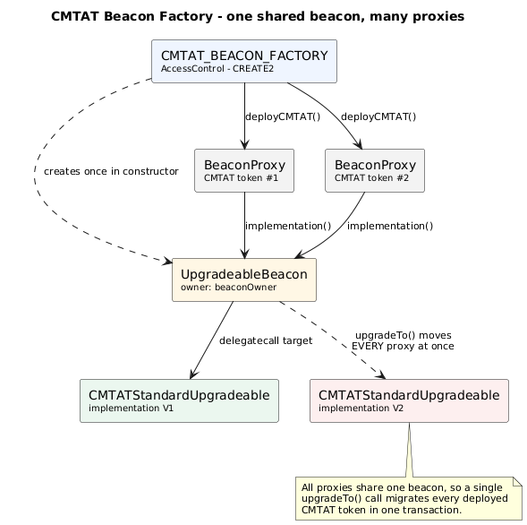

_Diagram source: [`doc/schema/plantuml/beacon-factory.puml`](./schema/plantuml/beacon-factory.puml)._

#### Inheritance

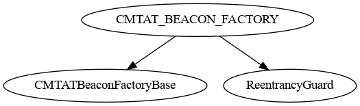

#### Graph

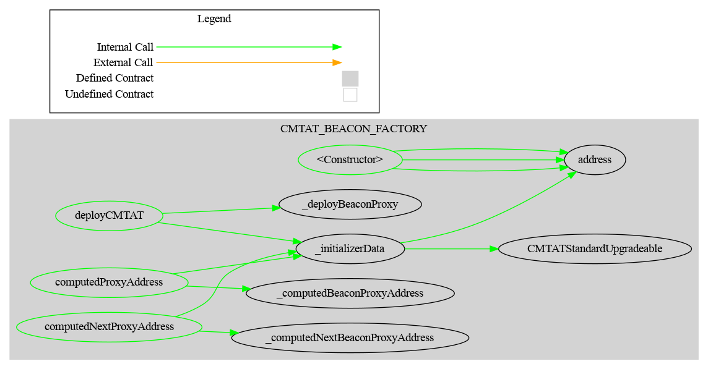

#### Ethereum API

##### `deployCMTAT(bytes32, CMTAT_ARGUMENT) -> (BeaconProxy cmtat)`

Deploys a CMTAT token implementation behind a BeaconProxy.

**Parameters:**

| Name                | Type           | Description                                                  |
| ------------------- | -------------- | ------------------------------------------------------------ |
| deploymentSaltInput | bytes32        | Salt used for deterministic deployment (via CREATE2).        |
| cmtatArgument       | CMTAT_ARGUMENT | Struct containing initializer arguments for the CMTAT contract. |

**Return Values:**

| Name  | Type        | Description                                                  |
| ----- | ----------- | ------------------------------------------------------------ |
| cmtat | BeaconProxy | The deployed BeaconProxy instance pointing to the CMTAT implementation. |

------

##### `computedProxyAddress(bytes32, CMTAT_ARGUMENT) ->(address cmtatProxy)`

Get the predicted BeaconProxy address for a given deployment salt without deploying it.

**Parameters:**

| Name           | Type           | Description                                                  |
| -------------- | -------------- | ------------------------------------------------------------ |
| deploymentSalt | bytes32        | Salt used for deterministic deployment (via CREATE2).        |
| cmtatArgument  | CMTAT_ARGUMENT | Struct containing initializer arguments for the CMTAT contract. |

**Return Values:**

| Name       | Type    | Description                                                 |
| ---------- | ------- | ----------------------------------------------------------- |
| cmtatProxy | address | The computed address of the BeaconProxy for the given salt. |

------

##### `implementation() -> (address beaconImplementation)`

Get the current implementation address stored in the UpgradeableBeacon.

**Return Values:**

| Name                 | Type    | Description                                   |
| -------------------- | ------- | --------------------------------------------- |
| beaconImplementation | address | Address of the CMTAT implementation contract. |

### Transparent Proxy Factory

In the transparent proxy architecture, there are three contracts:

1. **Proxy admin contract**: controls and upgrades the proxy contract.
2. **Transparent proxy contract**: acts as the main entry point for the contract user.
3. **Implementation contract**: contains the code of your smart contract, in this case, the CMTAT. 

This architecture is more complex than a clone proxy because the proxy can be upgraded to point to a new implementation.

Moreover, the upgrade function is coded within the proxy itself, making the proxy larger to deploy than a UUPS proxy.

The factory will use the same implementation for each transparent proxy deployed. 

- Each transparent proxy has its own proxy admin, deployed inside the constructor of the transparent proxy. 
- Each transparent proxy can upgrade their implementation to a new one independently and without impact on other proxies.


#### Inheritance

 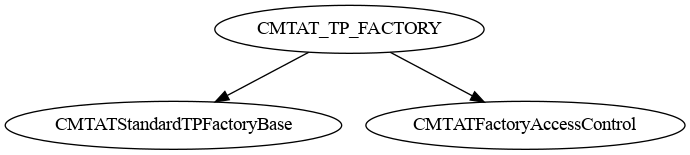

#### Graph

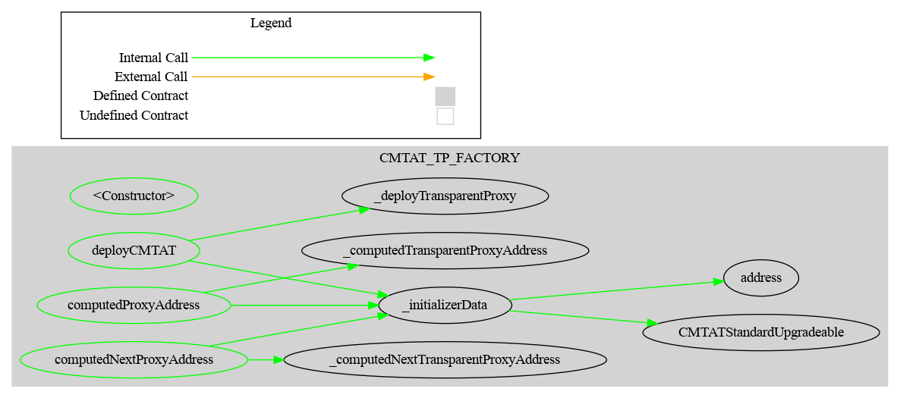

#### Ethereum API

##### `computedProxyAddress(bytes32,address, CMTAT_ARGUMENT) -> (address cmtatProxy)`

Get the predicted proxy address for a given deployment salt without deploying it.

**Parameters:**

| Name            | Type           | Description                                                  |
| --------------- | -------------- | ------------------------------------------------------------ |
| deploymentSalt  | bytes32        | Salt used for deterministic deployment (via CREATE2).        |
| proxyAdminOwner | address        | Address that will own the ProxyAdmin contract.               |
| cmtatArgument   | CMTAT_ARGUMENT | Struct containing initializer arguments for the CMTAT contract. |

**Return Values:**

| Name       | Type    | Description                                                 |
| ---------- | ------- | ----------------------------------------------------------- |
| cmtatProxy | address | The computed address of the CMTAT proxy for the given salt. |

------

##### `deployCMTAT(bytes32,address, CMTAT_ARGUMENT) -> (TransparentUpgradeableProxy cmtat)`

Deploys a CMTAT token implementation behind a TransparentUpgradeableProxy, along with a new ProxyAdmin contract. The ProxyAdmin is created inside the proxy's constructor and owned by `proxyAdminOwner`; its address is not returned (read it from the proxy's `AdminChanged` event).

**Parameters:**

| Name                | Type           | Description                                                  |
| ------------------- | -------------- | ------------------------------------------------------------ |
| deploymentSaltInput | bytes32        | Salt used for deterministic deployment (via CREATE2).        |
| proxyAdminOwner     | address        | Address that will own the ProxyAdmin contract.               |
| cmtatArgument       | CMTAT_ARGUMENT | Struct containing initializer arguments for the CMTAT contract. |

**Return Values:**

| Name  | Type                       | Description                                |
| ----- | -------------------------- | ------------------------------------------ |
| cmtat | TransparentUpgradeableProxy | The deployed TransparentUpgradeableProxy. |

------

### UUPS ProxyFactory

Contrary to the Transparent Proxy, the logic to upgrade the proxy is situated in the implementation and not in the proxy, making the proxy cheaper to deploy. 

The factory will use the same implementation for each UUPS proxy deployed. 

- Each UUPS proxy can upgrade their implementation to a new one independently and without impact on other proxies.
- This is the reason why there is a specific CMTAT contract which includes this logic to use: `CMTATUpgradeableUUPS`

#### Inheritance

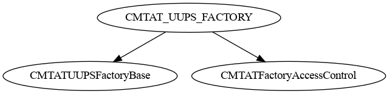

#### Graph

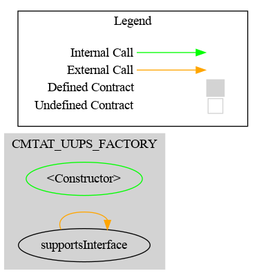

#### Ethereum API

##### `deployCMTAT(bytes32, CMTAT_ARGUMENT) -> (ERC1967Proxy cmtat)`

Deploys a CMTAT token implementation behind a UUPS proxy using a deterministic salt.

**Parameters:**

| Name                | Type           | Description                                                  |
| ------------------- | -------------- | ------------------------------------------------------------ |
| deploymentSaltInput | bytes32        | Salt used for deterministic deployment (via CREATE2).        |
| cmtatArgument       | CMTAT_ARGUMENT | Struct containing initializer arguments for the CMTAT contract. |

**Return Values:**

| Name  | Type         | Description                                                  |
| ----- | ------------ | ------------------------------------------------------------ |
| cmtat | ERC1967Proxy | The deployed ERC1967Proxy instance pointing to the CMTAT implementation. |

------

##### `computedProxyAddress(bytes32, CMTAT_ARGUMENT) -> (address cmtatProxy)`

Get the predicted proxy address for a given deployment salt without deploying it.

**Parameters:**

| Name           | Type           | Description                                                  |
| -------------- | -------------- | ------------------------------------------------------------ |
| deploymentSalt | bytes32        | Salt used for deterministic deployment (via CREATE2).        |
| cmtatArgument  | CMTAT_ARGUMENT | Struct containing initializer arguments for the CMTAT contract. |

**Return Values:**

| Name       | Type    | Description                                                 |
| ---------- | ------- | ----------------------------------------------------------- |
| cmtatProxy | address | The computed address of the CMTAT proxy for the given salt. |


### CMTAT Light Factories

Two additional factories deploy the lighter `CMTATUpgradeableLight` implementation:

- **`CMTAT_LIGHT_TP_FACTORY`** ([contracts/light/CMTAT_LIGHT_TP_FACTORY.sol](../contracts/light/CMTAT_LIGHT_TP_FACTORY.sol)) — Transparent proxy variant. Same architecture as the [Transparent Proxy Factory](#transparent-proxy-factory).
- **`CMTAT_LIGHT_BEACON_FACTORY`** ([contracts/light/CMTAT_LIGHT_BEACON_FACTORY.sol](../contracts/light/CMTAT_LIGHT_BEACON_FACTORY.sol)) — Beacon proxy variant. Same architecture as the [Beacon Proxy Factory](#beacon-proxy-factory). When `implementation_ == address(0)`, the constructor deploys a fresh `CMTATUpgradeableLight` implementation.

Both expose the same entrypoints as their standard counterparts but take `CMTAT_LIGHT_ARGUMENT` instead of `CMTAT_ARGUMENT`:

| Factory | Entrypoint signature |
| --- | --- |
| `CMTAT_LIGHT_TP_FACTORY` | `deployCMTAT(bytes32, address proxyAdminOwner, CMTAT_LIGHT_ARGUMENT) -> (TransparentUpgradeableProxy cmtat)` |
| `CMTAT_LIGHT_TP_FACTORY` | `computedProxyAddress(bytes32, address proxyAdminOwner, CMTAT_LIGHT_ARGUMENT) -> (address cmtatProxy)` |
| `CMTAT_LIGHT_BEACON_FACTORY` | `deployCMTAT(bytes32, CMTAT_LIGHT_ARGUMENT) -> (BeaconProxy cmtat)` |
| `CMTAT_LIGHT_BEACON_FACTORY` | `computedProxyAddress(bytes32, CMTAT_LIGHT_ARGUMENT) -> (address cmtatProxy)` |

#### Inheritance

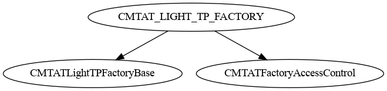

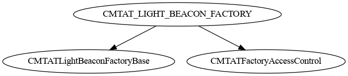

#### Graph

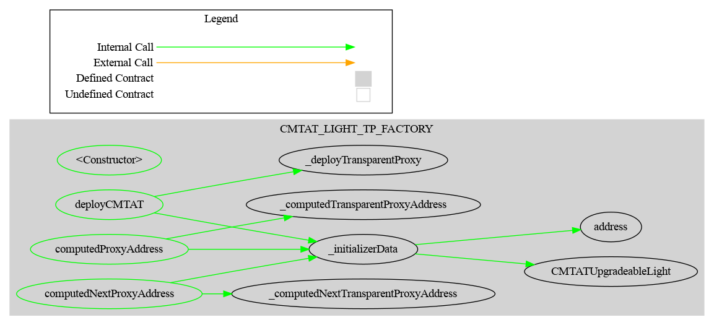

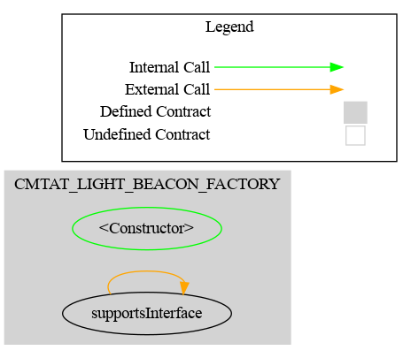


## Usage instructions

> **AI assistance:** Parts of this project were written with the help of AI coding assistants, principally Claude Code (Anthropic) and Codex (OpenAI).

### Dependencies

The toolchain includes the following components, where the versions
are the latest ones that we tested: 

- npm 10.2.5
- Hardhat ^2.26.1
- Node 20.5.0
- Smart contract
  - Solidity [0.8.36](https://docs.soliditylang.org/en/v0.8.36/) (via solc-js)
  - EVM: Prague
  - CMTAT [v3.3.0-rc3](https://github.com/CMTA/CMTAT/releases/tag/v3.3.0-rc3)
  - OpenZeppelin Contracts (Node.js module) [v5.7.0](https://github.com/OpenZeppelin/openzeppelin-contracts/releases/tag/v5.7.0) 
  - OpenZeppelin Contracts Upgradeable (Node.js module) [v5.7.0](https://github.com/OpenZeppelin/openzeppelin-contracts-upgradeable/releases/tag/v5.7.0)


### Installation

- Clone the repository

Clone the git repository, with the option `--recurse-submodules` to fetch the submodules:

`git clone git@github.com:CMTA/CMTATFactory.git  --recurse-submodules`  

- Node.js version

We recommend to install the [Node Version Manager `nvm`](https://github.com/nvm-sh/nvm) to manage multiple versions of Node.js on your machine. You can then, for example, install the version 20.5.0 of Node.js with the following command: `nvm install 20.5.0`

The file [.nvmrc](../.nvmrc) at the root of the project set the Node.js version. `nvm use`will automatically use this version if no version is supplied on the command line.

- node modules

To install the node modules required by CMTAT, run the following command at the root of the project:

`npm install`

### Hardhat

> To use Hardhat, the recommended way is to use the version installed as
> part of the node modules, via the `npx` command:

`npx hardhat`

Alternatively, you can install Hardhat [globally](https://hardhat.org/hardhat-runner/docs/getting-started):

`npm install -g hardhat` 

See Hardhat's official [documentation](https://hardhat.org) for more information.

#### Contract size

You can get the size of the contract by running the following commands.

- Compile the contracts:

```bash
npx hardhat compile
```

- Run the script:

```bash
npm run-script size
```

The script calls the plugin [hardhat-contract-sizer](https://www.npmjs.com/package/hardhat-contract-sizer) with Hardhat.

#### Testing

Tests are written in JavaScript using [ethers.js](https://docs.ethers.org/) together with Mocha, Chai, and `@nomicfoundation/hardhat-network-helpers`, and run **only** with Hardhat as follows:

`npx hardhat test`

To use the global hardhat install, use instead `hardhat test`.

Please see the Hardhat [documentation](https://hardhat.org/tutorial/testing-contracts) for more information about the writing and running of  Hardhat.


#### Code style guidelines

We use linters to ensure consistent coding style. If you contribute code, please run this following command: 

For JavaScript:

```bash
npm run-script lint:js 
npm run-script lint:js:fix 
```

For Solidity:

```bash
npm run-script lint:sol  
npm run-script lint:sol:fix
```

### Generate documentation

#### [Surya](https://github.com/ConsenSys/surya)

To generate documentation with surya, you can call the three bash scripts in [doc/script](./script)

| Task                 | Script                      | Command exemple                                              |
| -------------------- | --------------------------- | ------------------------------------------------------------ |
| Generate graph       | script_surya_graph.sh       | npx surya graph -i contracts/**/*.sol <br />npx surya graph contracts/CMTAT_TP_FACTORY.sol |
| Generate inheritance | script_surya_inheritance.sh | npx surya inheritance contracts/modules/CMTAT_TP_FACTORY.sol -i <br />npx surya inheritance contracts/modules/CMTAT_TP_FACTORY.sol |
| Generate report      | script_surya_report.sh      | npx surya mdreport -i surya_report.md contracts/modules/CMTAT_TP_FACTORY.sol <br />npx surya mdreport surya_report.md contracts/modules/CMTAT_TP_FACTORY.sol |

In the report, the path for the different files are indicated in absolute. You have to remove the part which correspond to your local filesystem.


#### [Coverage](https://github.com/sc-forks/solidity-coverage/)

Code coverage for Solidity smart-contracts, installed as a hardhat plugin

```bash
npm run-script coverage
```


## Security

### Vulnerability disclosure

Please see [SECURITY.md](https://github.com/CMTA/CMTAT/blob/master/SECURITY.md) (CMTAT main repository).

### Audit

> **Note:** This project has not undergone an audit and is provided as-is without any warranties.

### Tools

Static-analysis reports are versioned under [`doc/audits/`](./audits/); see the [audit overview](./audits/AUDIT_OVERVIEW.md) for the consolidated results and triage. All runs exclude mocks and exclude dependencies / the CMTAT submodule from scope. **For v0.4.0, neither tool reports anything to fix.**

#### [Slither](https://github.com/crytic/slither)

Slither is a Solidity static analysis framework written in Python3

```bash
slither . --checklist --filter-paths "node_modules,CMTAT,test,forge-std,mocks" > slither-report.md
```

| Version | Report | Feedback |
| --- | --- | --- |
| v0.4.0 | [slither-report.md](./audits/v0.4.0/slither-report.md) | [feedback](./audits/v0.4.0/slither-report-feedback.md) |
| v0.3.0 | [slither-report.md](./audits/v0.3.0/slither-report.md) | [feedback](./audits/v0.3.0/slither-report-feedback.md) |
| v0.2.0 | [slither-report.md](./audits/v0.2.0/slither-report.md) | — |

#### Aderyn

Here is the list of reports performed with [Aderyn](https://github.com/Cyfrin/aderyn)

```bash
aderyn -x mocks --output aderyn-report.md
```

| Version | Report | Feedback |
| --- | --- | --- |
| v0.4.0 | [aderyn-report.md](./audits/v0.4.0/aderyn-report.md) | [feedback](./audits/v0.4.0/aderyn-report-feedback.md) |
| v0.3.0 | [aderyn-report.md](./audits/v0.3.0/aderyn-report.md) | [feedback](./audits/v0.3.0/aderyn-report-feedback.md) |
| v0.2.0 | [aderyn-report.md](./audits/v0.2.0/aderyn-report.md) | — |

#### [Nethermind AuditAgent](https://auditagent.nethermind.io/)

[Nethermind AuditAgent](https://auditagent.nethermind.io/) is an AI-powered automated smart-contract scanner. The report was independently verified against the source in the linked feedback file.

> Note: This scan was performed by an AI-powered automated tool, not a formal human-led audit.

| Version | Result | Report | Feedback |
| --- | --- | --- | --- |
| v0.3.0 | 0 High · 0 Medium · 1 Low · 1 Info — **nothing to fix** (both accepted as design; hardened in v0.4.0) | [audit_agent_report_v0.3.0.pdf](./audits/v0.3.0/audit_agent_report_v0.3.0.pdf) | [feedback](./audits/v0.3.0/audit_agent_report-feedback.md) |


## Further reading

For more details and test scenario, you can read this article on the Taurus blog: [Making CMTAT Tokenization More Scalable and Cost-Effective with Proxy and Factory Contracts](https://www.taurushq.com/blog/cmtat-tokenization-deployment-with-proxy-and-factory/).

This article uses the CMTAT version [2.5.1](https://github.com/CMTA/CMTAT/releases/tag/v2.5.1) when the factory code was still included in the CMTAT repository, corresponding to Factory release `0.1.0`. The current factory version is `0.5.0` (exposed on-chain through `version()`, see [Versioning (ERC-8303)](#versioning-erc-8303)).

## Intellectual property

The code is copyright (c) Capital Market and Technology Association, 2025-2026, and is released under [Mozilla Public License 2.0](../LICENSE.md).
